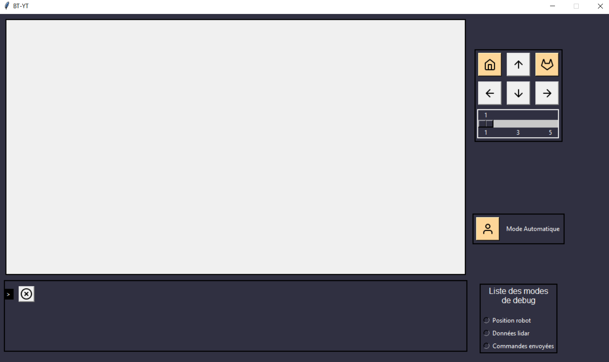

= [Projet Fil Rouge] Partie 3 - Interface Python Tkinter - Cartographie

Auteurs :
Constant ROUX,
Peter PIRIOU--DEZY,
Guillaume ROUSSIN,
Julian TRANI, 
Pierre PINÇON,
Baptiste RAMONDA

Dernière mise à jour : 22/05/2022

== Installation 

WARNING: Avoir une version de Python installé sur votre pc

- Clonez le projet avec le lien suivant : https://github.com/gui-upssitech/pfr3-interface

- Exécutez le _source/main.py_

== Présentation 

Cette application permet de lire les données du Lidar depuis un _serial port_ configuré .

Voici un petit aperçu visuel de l'application :

